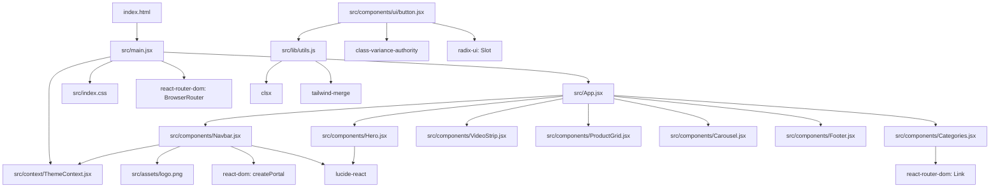
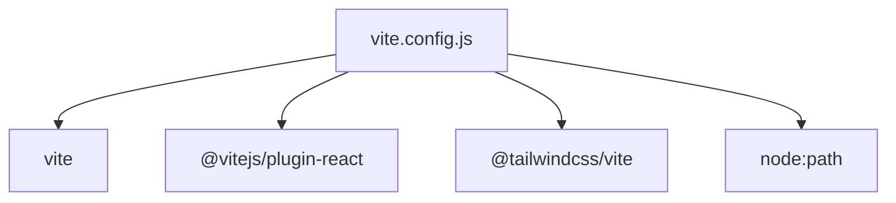

# Project Graph

Generated from local imports in `src` and root config files.

## Main Render Flow

`index.html` mounts `src/main.jsx`, which wraps `src/App.jsx` in `ThemeProvider` and `BrowserRouter`.

`src/App.jsx` renders the page in this order:

1. `Navbar`
2. `Hero`
3. `Categories`
4. `VideoStrip`
5. `ProductGrid`
6. `Carousel`
7. `Footer`

## Not Currently Imported

These files exist in `src` but are not reached from the current import graph:

- `src/App.css`
- `src/assets/hero.png`
- `src/assets/react.svg`
- `src/assets/vite.svg`
- `src/components/Test.jsx`
- `src/components/VideoGrid.jsx`
- `src/components/ui/button.jsx`
- `src/components/ui/dialog.jsx`

## Root Tooling

